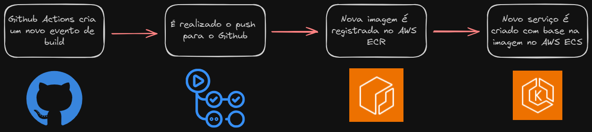
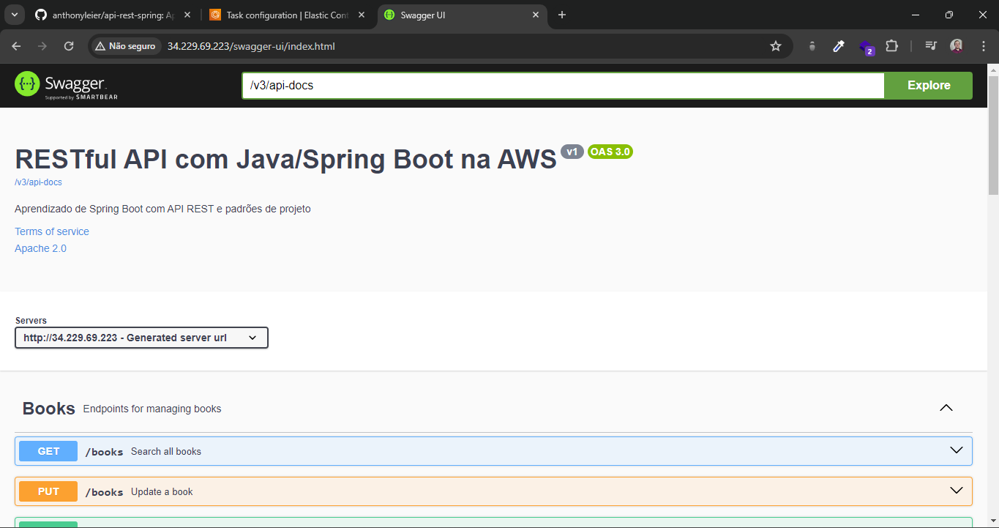
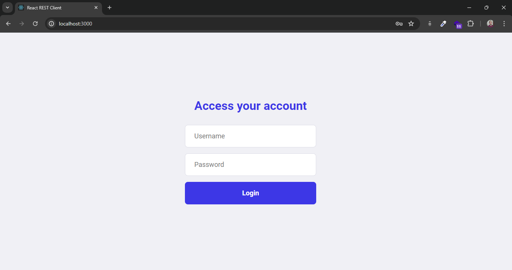
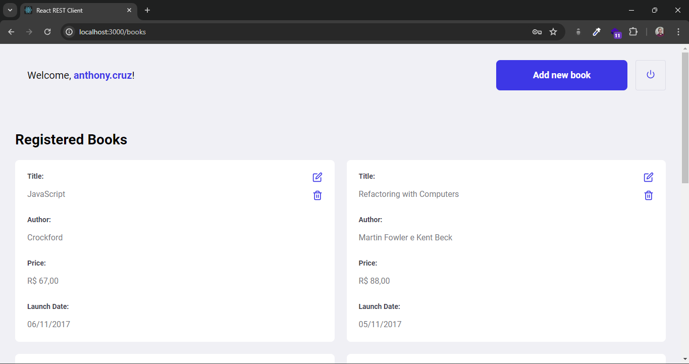
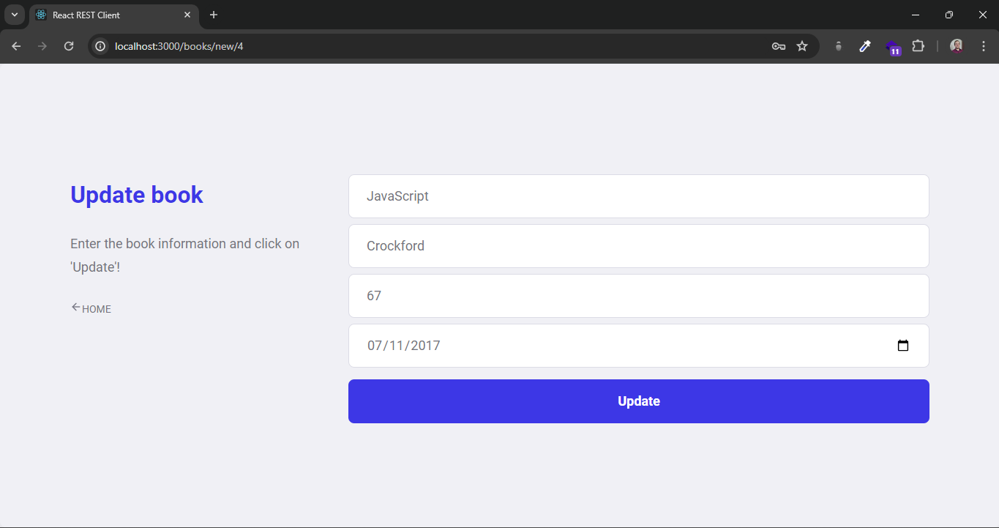

# api-rest-spring

O projeto foi desenvolvido na realização do curso [REST API's](https://www.udemy.com/course/restful-apis-do-0-a-nuvem-com-springboot-e-docker/) do [@leandrocgsi](https://github.com/leandrocgsi). Para isto, foi utilizado o Java 21 com Spring Boot na versão 3.2.5.

Durante o desenvolvimento foi abordado diversos conceitos fundamentais do REST, Design Patterns, Versionamento de APIs, Tratamento de Exceções, ModelMapper, Migrations com Flyway, Content Negotiation para JSON e XML, HATEOAS. Aplicando boas práticas, como a documentação em Swagger, configuração de CORS, segurança com autenticação e autorização através de JWT.

Foi possível também abordar outros conceitos como trabalhar com Upload e Download de arquivos através de um endpoint. Também foram criados testes automatizados com JUnit, Mockito, TestContainers para o MySQL e Rest Assured. Como forma de teste manual, também é possível consultar a aplicação com base nos exemplos disponibilizados no diretório [postman](postman) que pode ser diretamente importados como collections e enviroments dentro do Postman.

Por fim, a aplicação foi dockerizada, através de Dockerfile com possibilidade de Docker Compose para o banco local e implementada na AWS, utilizando recursos como ECR e ECS. Por razões financeiras, a aplicação foi removida da AWS, mas toda a documentação desse processo pode ser encontrada abaixo.

## CI/CD
Foi criada uma esteira de CI/CD com a utilização do Github Actions para implantação na AWS, que pode ser conferida no arquivo [ci.yml](.github/workflows/ci.yml).

### RDS - Banco de Dados
Para a aplicação, foi implantado um banco de dados MySQL através do serviço RDS da Amazon AWS.

### IAM - Usuários
Foi criado um usuário exclusivo para uso pelo Github Actions.

### ECR - Repositórios
Foi criado um reposiório para armazenar as Docker Images com ECR.

### ECR - Imagens
As imagens armazenadas foram tagueadas conforme o id da build do Github Actions, mantendo sempre a latest para o deploy.

### ECS - Definições de Tarefas
As Task Definition são criadas para definir as configurações de criação do container, a cada deploy do Github Action, ela é atualizada com a nova imagem Docker.

### ECS - Conjuntos
O cluster é responsável por gerir toda a infraestrutura utilizada pelo seus services dentro da AWS.

### ECS - Serviços
Dentro do Cluster, temos a criação do Service com base na Task Definition criada anteriormente.

### Deploy Finalizado - AWS
Por fim, com todo o processo finalizado, foi possível acessar o endpoint referente ao Swagger (/swagger-ui/index.html)

## Frontend
Como anexo a este projeto, também foi desenvolvido um frontend em React que consome essa aplicação, que pode ser acessado no diretório [frontend](frontend). Como é apenas um simples client para esta aplicação e não é o foco do repositório, decidi manter esse mini projeto em uma subpasta.

### Login
Tela de login onde se consulta e utiliza o token JWT em localStorage.

### Listagem
Tela de listagem de todos os livros retornados pela API, com botão para "Ver mais", onde é utilizado o recurso de paginação da API. Também é possível deletar livros nessa tela.

### Cadastrar
Tela de cadastro de um novo livro.

### Atualizar
Tela de atualização para um livro. É a mesma página de cadastro, porém com alterações para esse comportamento.

